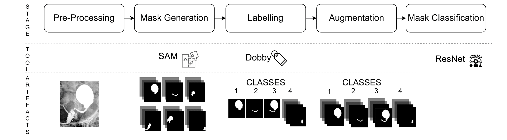

<!-- # STELLA - Segmentation Tool for Enhanced Localisation and Labelling of diagnostic Areas
This repository is the official code for the paper "Toward Paediatric Digital Twins: STELLA-Segmentation Tool for Enhanced Localisation and Labelling of diagnostic Areas" by Roberta De Fazio, Maria Stella de Biase, Pierluigi Marzuillo, Paola Tirelli, Fiammetta Marulli, Stefano Marrone, Laura Verde.

## Citation
Please cite our work if you find it useful for your research and work.

```
@article{DeFazio2024,
  title = {Toward Paediatric Digital Twins: STELLA-Segmentation Tool for Enhanced Localisation and Labelling of diagnostic Areas},
  volume = {},
  ISSN = {},
  DOI = {},
  journal = {Procedia Computer Science},
  publisher = {Elsevier BV},
  author = {De Fazio,  Roberta and de Biase,  Maria Stella and Marzuillo,  Pierluigi and Tirelli, Paola and Marulli, Fiammetta and Marrone,  Stefano and Verde,  Laura},
  year = {2025},
  pages = {}
}
```

## Dependencies

The code relies on the following Python 3.9 + libs.

Packages needed are:
* torch 2.6.0
* torchvision 0.21.0
* matplotlib 3.9.4
* pandas 2.2.3
* numpy 1.26.4
* opencv-python 4.11.0.86
* ipython 8.15.0
* scikit-learn 1.6.1
* Pillow 11.1.0
* tensorflow 2.19.0
* keras 3.9.2
* pytorch-cuda 11.8 
* seaborn 0.13.2

 
### Download and Integration of the SAM2 Model

To download and set up the SAM2 model, follow these steps:

```bash
git clone https://github.com/facebookresearch/segment-anything.git

wget -O models/sam_vit_h_4b8939.pth https://dl.fbaipublicfiles.com/segment_anything/sam_vit_h_4b8939.pth
```

## Execution
### Parameters configuration in configuration.ini
### Folder Structure Setup
To initialize the required folder structure for the project, run the following commands in your terminal:

```bash
mkdir -p experiments/img/dumps experiments/img/test experiments/img/preprocessed experiments/img/masks experiments/input experiments/output/models experiments/output/report_labels experiments/models
```
### Preprocessing & Mask Generation
To run preprocessing and SAM models on the image:
```bash
python3 main.py configuration.ini classification
```
### Labelling
To run Dobby tool for masks labelling:
```bash
python3 main.py configuration.ini process
```

### Augmentation & Classification
Remember to set "augmentation" in section [classification] under keyword "preprocessing:" in configuration.ini

To run Augmentation and masks Classification:
```bash
python3 main.py configuration.ini classification
```
 -->


<h1 align="center">STELLA
  <br/>
  <sub>Segmentation Tool for Enhanced Localisation and Labelling of diagnostic Areas</sub>
</h1>

<p align="center">
  <a href="https://python.org"></a>
  
  <a href="https://github.com/facebookresearch/segment-anything"></a>
  <a href="https://github.com/Ste-lla02/stella/stargazers"></a>
</p>

<p align="center">
  
</p>


> **STELLA** is a modular pipeline for medical-image segmentation and weak/interactive labelling built around **SAM2** and a light classification stage. It supports preprocessing, mask generation, manual/assisted labelling ("Dobby" tool), data augmentation, and classifier training — all configurable from a single `configuration.ini`. This repository is the official code for the paper "Toward Paediatric Digital Twins: STELLA-Segmentation Tool for Enhanced Localisation and Labelling of diagnostic Areas" by Roberta De Fazio, Maria Stella de Biase, Pierluigi Marzuillo, Paola Tirelli, Fiammetta Marulli, Stefano Marrone, Laura Verde.

---

## ✨ Highlights

* **End-to-end pipeline**: preprocess → segment (SAM2) → label (Dobby) → augment → classify → report.
* **Config-first**: reproducible runs controlled from `configuration.ini`.
* **Batteries included**: sensible defaults, ready-to-use folder bootstrap.
* **Research-friendly**: deterministic seeds, experiment dumps, and clean artifacts layout.

---

## 📥 Installation

> Requirements: Python **3.9+** and a CUDA-enabled GPU (optional but recommended).

```bash
# 1) Clone the repo
git clone https://github.com/Ste-lla02/stella.git
cd stella

# 2) (Recommended) Create a virtual environment
python3 -m venv .venv && source .venv/bin/activate   # on Windows: .venv\\Scripts\\activate

# 3) Install dependencies
pip install -r requirements.txt
```

## 📦 requirements.txt
```torch==2.6.0
torchvision==0.21.0
matplotlib==3.9.4
pandas==2.2.3
numpy==1.26.4
opencv-python==4.11.0.86
ipython==8.15.0
scikit-learn==1.6.1
Pillow==11.1.0
tensorflow==2.19.0
keras==3.9.2
seaborn==0.13.2
#optional: pytorch-cuda==11.8 (per platform)
```


### 🔽 Download SAM2 weights

```bash
git clone https://github.com/facebookresearch/segment-anything.git
wget -O models/sam_vit_h_4b8939.pth \
  https://dl.fbaipublicfiles.com/segment_anything/sam_vit_h_4b8939.pth
```

---

## 🗂️ Project layout

```text
stella/
├── src/
│   └── ...                         # pipeline modules
├── Figures/                        # figures & doc assets (add banner here)
├── experiments/
│   └── img/
│       ├── dumps/
│       ├── test/
│       ├── preprocessed/
│       └── masks/
├── models/                         # SAM weights
├── experiments/output/
│   ├── models/
│   └── report_labels/
├── configuration.ini               # main config file
├── main.py                         
└── README.md
```

Bootstrap folders (first run will also create them):

```bash
mkdir -p experiments/img/dumps \
         experiments/img/test \
         experiments/img/preprocessed \
         experiments/img/masks \
         experiments/input \
         experiments/output/models \
         experiments/output/report_labels \
         experiments/models
```

---

## ⚙️ Configuration (`configuration.ini`)

Key sections you may want to edit:

| Section            | Key                                         | Description                                          |
| ------------------ | ------------------------------------------- | ---------------------------------------------------- |
| `[paths]`          | `input_dir`, `output_dir`                   | Where images and results live.                       |
| `[sam]`            | `weights_path`, `checkpoint`, `prompt_mode` | SAM2 model + prompting options.                      |
| `[preprocessing]`  | `resize`, `normalize`, `denoise`            | Image prep before segmentation.                      |
| `[labelling]`      | `tool`, `save_masks`                        | Enable **Dobby** assisted labelling and mask export. |
| `[classification]` | `preprocessing`, `augment`, `model`         | Controls augmentation and the classifier stage.      |

> See the inline comments in `configuration.ini` for all available options.

---

## 🚀 Quick start

### 1) Preprocess & generate masks (SAM2)

```bash
python3 main.py configuration.ini classification
```

This will run preprocessing and segmentation according to your config and save masks into `experiments/img/masks/`.

### 2) Manual/assisted labelling (Dobby)

```bash
python3 main.py configuration.ini process
```

Use the interactive tool to refine masks and export labels.

### 3) Augmentation & classification

Ensure `augmentation` is enabled under `[classification]` → `preprocessing`.

```bash
python3 main.py configuration.ini classification
```

Generates augmented data, trains the classifier, and writes reports to `experiments/output/`.

---

## 🧪 Reproducing the paper

This repository accompanies the paper:

> **Toward Paediatric Digital Twins: STELLA – Segmentation Tool for Enhanced Localisation and Labelling of diagnostic Areas**
> Roberta De Fazio, Maria Stella de Biase, Pierluigi Marzuillo, Paola Tirelli, Fiammetta Marulli, Stefano Marrone, Laura Verde.
> *Procedia Computer Science*, 2025. DOI: *TBA*.

### Cite us

```bibtex
@article{DeFazio2025,
  title   = {Toward Paediatric Digital Twins: STELLA—Segmentation Tool for Enhanced Localisation and Labelling of diagnostic Areas},
  author  = {De Fazio, Roberta and de Biase, Maria Stella and Marzuillo, Pierluigi and Tirelli, Paola and Marulli, Fiammetta and Marrone, Stefano and Verde, Laura},
  journal = {Procedia Computer Science},
  year    = {2025},
  doi     = {TBA}
}
```

---

## 🤝 Contributing

Contributions are welcome! Please:

1. Open an issue to discuss your idea.
2. Fork and create a feature branch.
3. Add tests (if applicable) and update docs.
4. Open a PR with a clear description and screenshots where helpful.

---

<p align="center">
  <sub>Made with ❤️ by the STELLA authors — if this helps your research, consider ⭐ starring the repo.</sub>
</p>


